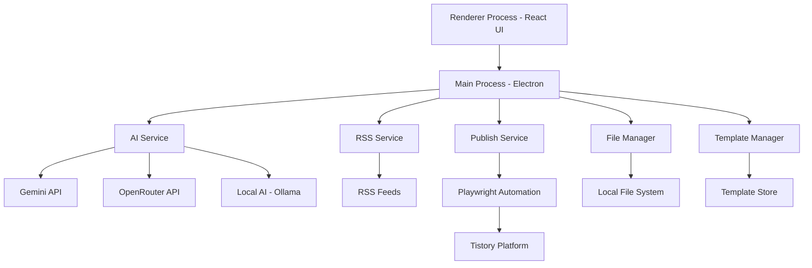

# AutoTistory AI Writer v1.0

AI 기반 티스토리 콘텐츠 자동 생성 및 발행 도구

[](https://opensource.org/licenses/MIT)
[](https://nodejs.org/)
[](https://electronjs.org/)
[](https://www.typescriptlang.org/)

## 📋 목차

- [프로젝트 개요](#-프로젝트-개요)
- [주요 기능](#-주요-기능)
- [기술 스택](#-기술-스택)
- [설치 가이드](#-설치-가이드)
- [사용 방법](#-사용-방법)
- [아키텍처](#-아키텍처)
- [기여 가이드](#-기여-가이드)
- [라이선스](#-라이선스)

## 🎯 프로젝트 개요

AutoTistory AI Writer는 AI 기술을 활용하여 티스토리 블로그 콘텐츠를 자동으로 생성하고 발행하는 통합 솔루션입니다. RSS 피드를 통한 콘텐츠 수집, AI 기반 콘텐츠 생성, 템플릿 관리, 예약 발행 등의 기능을 제공하여 블로거들의 생산성을 극대화합니다.

### 핵심 가치

- **자동화**: 반복적인 콘텐츠 생성 과정을 자동화하여 시간 절약
- **AI 기반 생성**: 최신 AI 모델을 활용한 고품질 콘텐츠 생성
- **템플릿 시스템**: 다양한 글쓰기 스타일과 주제에 맞는 템플릿 제공
- **예약 발행**: 원하는 시간에 콘텐츠를 자동으로 발행

## ✨ 주요 기능

### 🤖 AI 콘텐츠 생성

- **다양한 AI 제공자 지원**: Google Gemini, OpenRouter, 로컬 AI (Ollama)
- **자동 템플릿 선택**: 콘텐츠 주제에 맞는 최적의 템플릿 자동 선택
- **적응형 생성**: 콘텐츠에 맞는 새로운 템플릿 동적 생성
- **시리즈 생성**: 긴 콘텐츠를 여러 편으로 자동 분할 및 생성

### 📡 RSS 피드 관리

- **다중 소스 지원**: 여러 RSS 피드에서 콘텐츠 자동 수집
- **스마트 필터링**: 기간, 키워드 기반 콘텐츠 필터링
- **캐싱 시스템**: 효율적인 데이터 관리를 위한 캐싱

### 📝 템플릿 관리

- **페르소나 시스템**: 글쓰이 스타일을 정의하는 페르소나 템플릿
- **프롬프트 템플릿**: 다양한 주제와 형식에 맞는 프롬프트 템플릿
- **동적 조합**: 페르소나와 프롬프트의 자동 조합

### 🚀 자동 발행

- **티스토리 연동**: 티스토리 API를 통한 자동 발행
- **카테고리 관리**: 자동 카테고리 생성 및 관리
- **예약 발행**: 원하는 시간에 콘텐츠 발행 예약

### 📊 데이터 관리

- **파일 관리**: 생성된 콘텐츠의 체계적인 저장 및 관리
- **히스토리 추적**: 생성된 콘텐츠의 히스토리 관리
- **검색 기능**: 저장된 콘텐츠 빠른 검색

## 🛠 기술 스택

### 프론트엔드

- **React 19.2.3**: 사용자 인터페이스 구축
- **TypeScript 5.8.2**: 타입 안정성 확보
- **Vite 6.2.0**: 빠른 개발 환경 및 빌드 시스템
- **React Router 7.10.1**: 싱글 페이지 애플리케이션 라우팅
- **Zustand 5.0.9**: 상태 관리

### 백엔드

- **Electron 39.2.7**: 데스크톱 애플리케이션 프레임워크
- **Node.js**: 서버사이드 JavaScript 실행 환경
- **Playwright 1.57.0**: 웹 자동화 및 티스토리 연동
- **Winston 3.19.0**: 로깅 시스템

### AI 통합

- **Google Generative AI**: Gemini 모델 연동
- **OpenRouter API**: 다양한 AI 모델 통합
- **Ollama**: 로컬 AI 모델 지원

### 데이터 처리

- **RSS Parser 3.13.0**: RSS 피드 파싱
- **Node-cron 4.2.1**: 예약 작업 스케줄링
- **Electron Store 8.1.0**: 설정 데이터 저장

## 🚀 설치 가이드

### 시스템 요구사항

- **Node.js**: 18.0.0 이상
- **운영체제**: Windows 10+, macOS 10.15+, Ubuntu 20.04+
- **메모리**: 최소 4GB RAM (권장 8GB)
- **저장 공간**: 최소 2GB 여유 공간

### 설치 과정

1. **저장소 클론**

   ```bash
   git clone https://github.com/Declan-User/autotistory-ai-writer.git
   cd autotistory-ai-writer
   ```

2. **의존성 설치**

   ```bash
   # pnpm 사용 (권장)
   pnpm install

   # 또는 npm 사용
   npm install
   ```

3. **개발 환경 실행**

   ```bash
   # 개발 모드로 실행
   pnpm dev

   # 또는 npm 사용
   npm run dev
   ```

4. **애플리케이션 빌드**

   ```bash
   # 개발 빌드
   pnpm build

   # 프로덕션 빌드
   pnpm dist
   ```

### 환경 설정

1. **AI API 키 설정**

   - 애플리케이션 설정에서 AI 제공자 선택
   - 해당 API 키 입력 (Gemini 또는 OpenRouter)
   - 로컬 AI 사용 시 Ollama 설치 및 설정

2. **티스토리 연동**
   - 티스토리 계정 정보 입력
   - 발행할 블로그 선택
   - 카테고리 설정

## 📖 사용 방법

### 1. 대시보드

애플리케이션 시작 시 대시보드에서 다음을 확인할 수 있습니다:

- 최근 생성된 콘텐츠 목록
- RSS 피드 수집 현황
- 예약된 발행 일정
- AI 사용 통계

### 2. RSS 피드 관리

1. **피드 추가**

   - `피드 관리` 페이지로 이동
   - RSS 피드 URL 추가
   - 수집 주기 설정

2. **콘텐츠 필터링**
   - 기간별 필터링 (1일, 3일, 7일, 30일)
   - 키워드 필터링
   - 소스별 필터링

### 3. 콘텐츠 생성

1. **소재 선택**

   - RSS 피드에서 생성할 소재 선택
   - 직접 텍스트 입력 또는 파일 업로드

2. **템플릿 선택**

   - 자동 템플릿 선택 (권장)
   - 또는 수동으로 페르소나와 프롬프트 조합 선택

3. **생성 옵션 설정**

   - 목표 언어 설정
   - 추가 지시사항 입력
   - 이미지 검색 키워드 설정

4. **콘텐츠 생성**
   - `생성` 버튼 클릭
   - AI가 콘텐츠 자동 생성
   - 미리보기 및 수정

### 4. 발행 관리

1. **즉시 발행**

   - 생성된 콘텐츠 선택
   - 카테고리 선택
   - `즉시 발행` 클릭

2. **예약 발행**
   - 발행 일시 선택
   - 카테고리 선택
   - `예약 발행` 클릭

### 5. 템플릿 관리

1. **템플릿 조회**

   - `템플릿` 페이지에서 기존 템플릿 확인
   - 페르소나와 프롬프트 조합 미리보기

2. **템플릿 생성**
   - `새 템플릿 생성` 클릭
   - 템플릿 유형 선택 (페르소나/프롬프트)
   - 내용 입력 및 저장

## 🏗 아키텍처

### 시스템 아키텍처



### 디렉토리 구조

```
src/
├── main/                    # 메인 프로세스 (Electron)
│   ├── config/             # 설정 관리
│   ├── ipc/                # IPC 통신
│   ├── services/           # 핵심 서비스
│   ├── types/              # 타입 정의
│   └── utils/              # 유틸리티
├── renderer/               # 렌더러 프로세스 (React)
│   ├── components/         # React 컴포넌트
│   ├── pages/              # 페이지 컴포넌트
│   ├── stores/             # 상태 관리
│   └── types/              # 타입 정의
```

### 핵심 서비스

1. **AiService**: AI 모델 연동 및 콘텐츠 생성
2. **RssService**: RSS 피드 수집 및 파싱
3. **PublishService**: 티스토리 발행 자동화
4. **TemplateManager**: 템플릿 관리 및 자동 선택
5. **FileManager**: 파일 시스템 관리
6. **SchedulerService**: 예약 작업 관리

## 🤝 기여 가이드

### 개발 환경 설정

1. **Fork 및 클론**

   ```bash
   git clone https://github.com/YOUR_USERNAME/autotistory-ai-writer.git
   cd autotistory-ai-writer
   ```

2. **의존성 설치**

   ```bash
   pnpm install
   ```

3. **개발 서버 시작**
   ```bash
   pnpm dev
   ```

### 코드 스타일

- **TypeScript**: 모든 코드는 TypeScript로 작성
- **Prettier**: 코드 포맷팅은 Prettier 사용
- **ESLint**: 코드 품질 검증은 ESLint 사용
- **Conventional Commits**: 커밋 메시지는 Conventional Commits 규칙 준수

### 커밋 규칙

```
<type>(<scope>): <subject>

<body>

<footer>
```

**타입 종류**:

- `feat`: 새로운 기능 추가
- `fix`: 버그 수정
- `docs`: 문서 변경
- `style`: 코드 포맷팅 (기능 변경 없음)
- `refactor`: 코드 리팩토링 (기능 변경 없음)
- `test`: 테스트 코드 추가 또는 수정
- `chore`: 빌드 프로세스, 패키지 매니저 설정 등

### PR 프로세스

1. **브랜치 생성**: 기능별로 브랜치 생성
2. **개발 및 테스트**: 코드 개발 및 테스트 완료
3. **PR 생성**: Pull Request 생성 및 설명 작성
4. **코드 리뷰**: 코드 리뷰 및 피드백 반영
5. **머지**: 승인 후 메인 브랜치에 머지

## 📄 라이선스

이 프로젝트는 MIT 라이선스 하에 배포됩니다. 자세한 내용은 [LICENSE](LICENSE) 파일을 참조하세요.

## 🆘 지원 및 문의

- **이슈 보고**: [GitHub Issues](https://github.com/Declan-User/autotistory-ai-writer/issues)
- **기능 요청**: [GitHub Discussions](https://github.com/Declan-User/autotistory-ai-writer/discussions)
- **문의사항**: [이메일](mailto:autotistory@example.com)

## 🔄 변경 로그

### v1.0.0 (2024-12-23)

#### 🎉 초기 릴리스

- AI 기반 콘텐츠 생성 기능
- RSS 피드 수집 및 관리
- 티스토리 자동 발행
- 템플릿 시스템
- 예약 발행 기능
- 다양한 AI 제공자 지원 (Gemini, OpenRouter, Ollama)

#### ✨ 주요 기능

- **자동 템플릿 선택**: 콘텐츠 주제에 맞는 최적의 템플릿 자동 선택
- **적응형 생성**: 콘텐츠에 맞는 새로운 템플릿 동적 생성
- **시리즈 생성**: 긴 콘텐츠를 여러 편으로 자동 분할 및 생성
- **다중 AI 지원**: Google Gemini, OpenRouter, 로컬 AI (Ollama) 지원
- **스마트 필터링**: 기간, 키워드 기반 콘텐츠 필터링

#### 🛠 기술적 개선

- Electron 39.2.7 기반 데스크톱 애플리케이션
- React 19.2.3 기반 현대적 UI
- TypeScript 5.8.2로 타입 안정성 확보
- Vite 6.2.0 빌드 시스템 도입

---

<div align="center">
  <p>AutoTistory AI Writer v1.0 - AI 기반 티스토리 콘텐츠 자동 생성 및 발행 도구</p>
  <p>Made with ❤️ by AutoStory Team</p>
</div>
